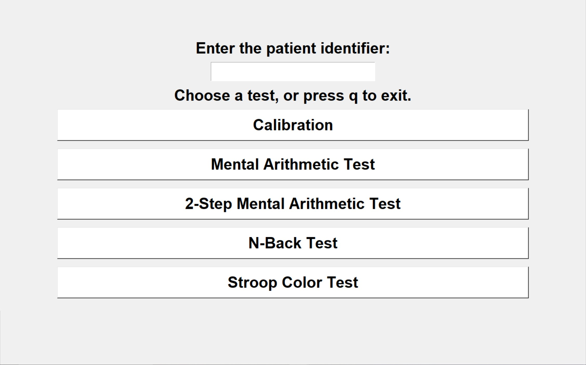
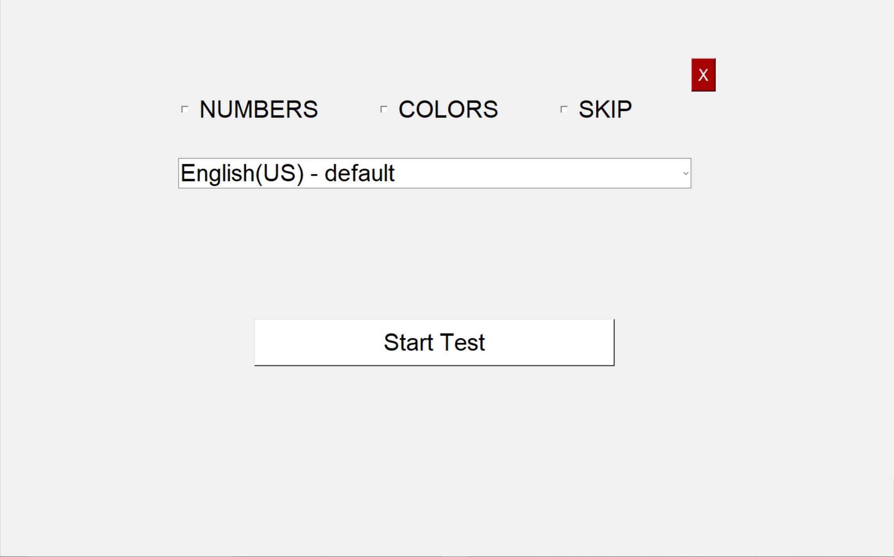
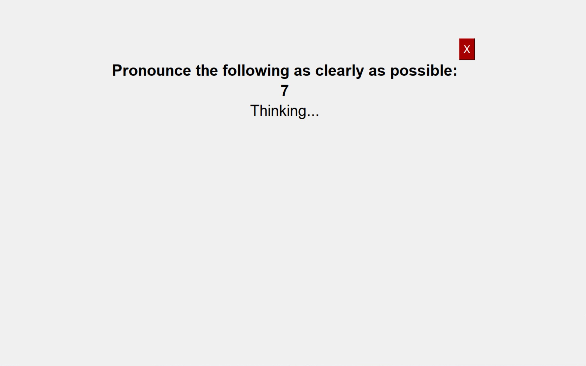
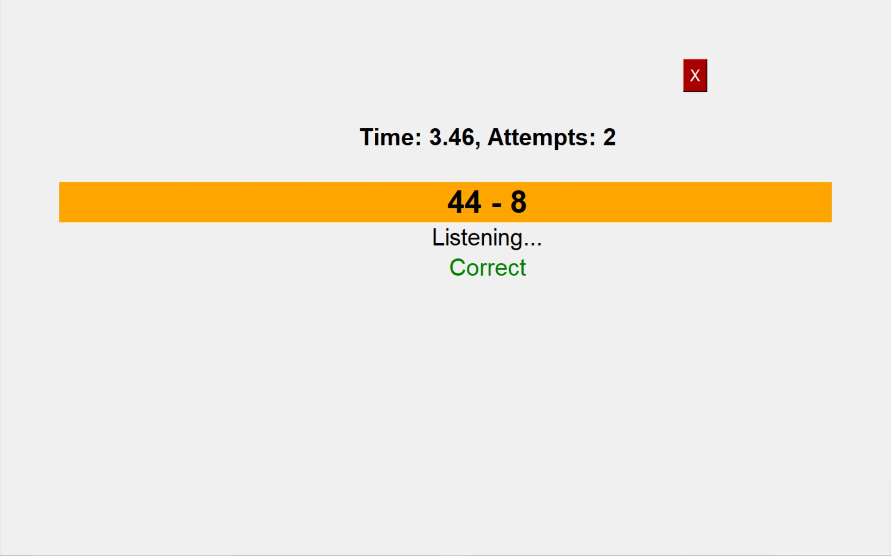
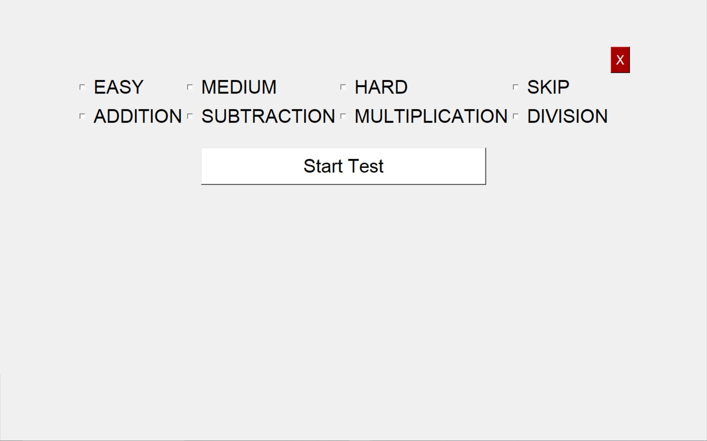
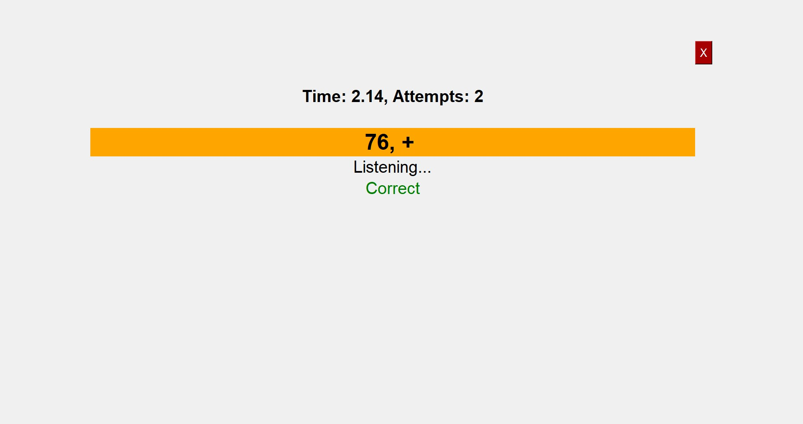
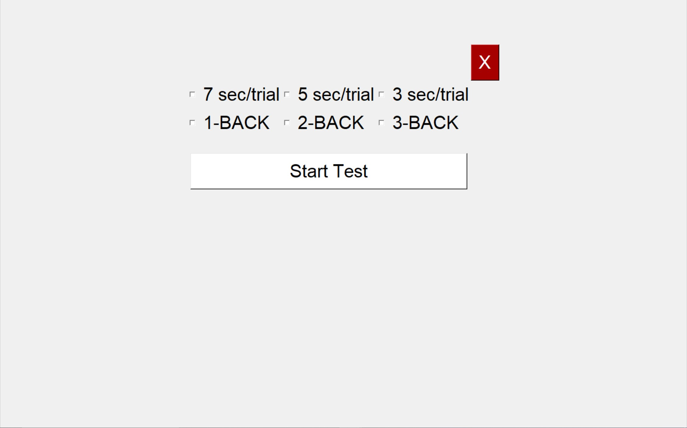
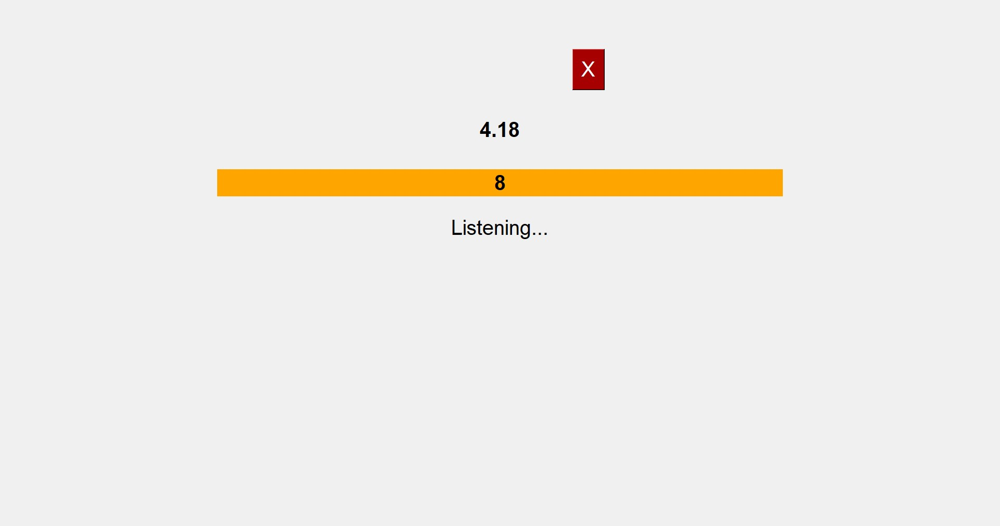
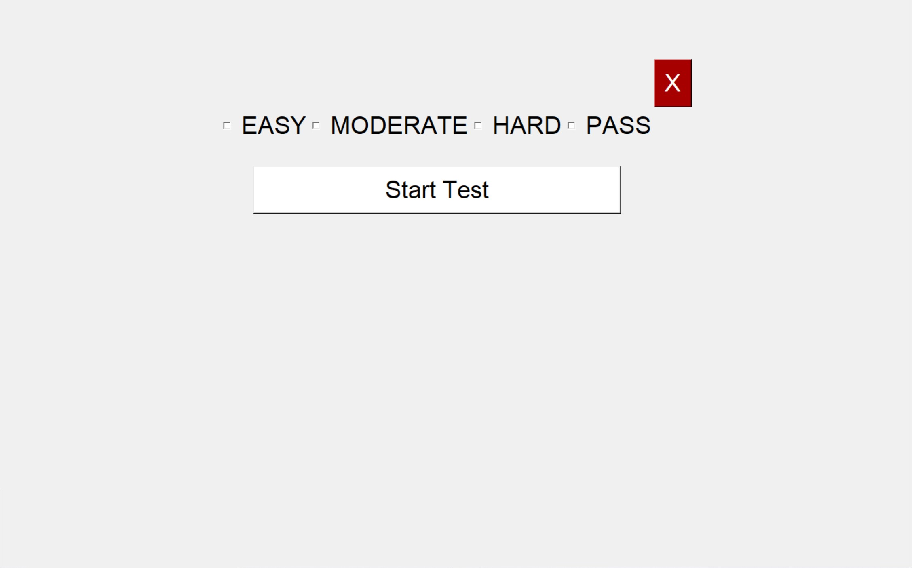
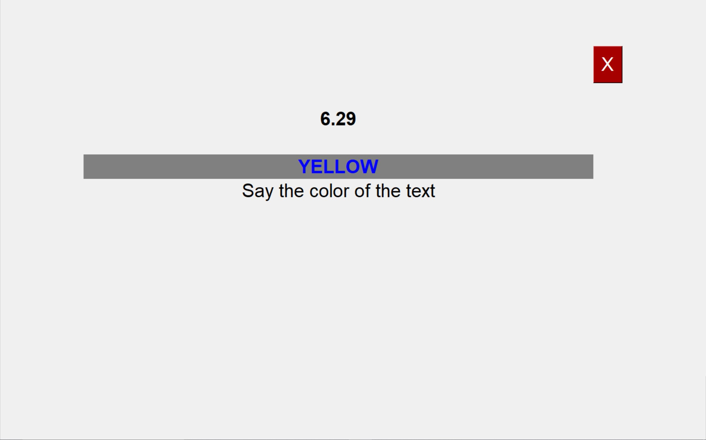

# Stress Test GUI Documentation

## Description

This GUI is intended to be used to conduct cognitive stress tests. The GUI contains some cognitive stress tasks designed
 to induce stress in a subject performing that task.

The GUI was developed in Python using the Tkinter library, and was exported to an executable file using the PyInstaller 
tool.

## Use

When the program is first run, the main menu will display. There are 2 requirements that should be fulfilled before 
beginning any tests:

 

1. A subject identifier, e.g., subject name or ID number, must be entered into the text box at the top. The program then
 uses this identifier to save the test response data (correctness of the answer and time taken by subject). This data is
  separate from the AcqKnowledge data collected from sensors.

If the patient identifier is not entered, the program defaults to a value of &#39;Unknown.&#39; This could cause the 
test response data for multiple subjects to be saved into the same location on the computer, making it difficult to 
differentiate the test response data of different subjects. The AcqKnowledge sensor data is not affected by this.

2. A calibration procedure must be completed to help prevent any errors in the speech recognition algorithm used to 
detect the subject&#39;s answers.

After these two requirements have been fulfilled, all the tests will work properly.

There are four tests / tasks included in this program:

- a 1-step mental arithmetic task
- a 2-step mental arithmetic task
- an n-back test
- a Stroop color test

The procedures for each of these tests will be explained in the following sections.

## Calibration Procedure

The calibration procedure allows the speech recognition algorithm to correctly recognize how the subject pronounces 
various numbers and colors before the tests begin.

The program then evaluates this calibration input, and uses the subject-specific pronunciations to help improve the 
accuracy of the speech recognition during the tests/tasks.

To begin calibration, click on the appropriate button in the main menu. This will open the calibration setup menu.

Any number of the checkboxes can be selected to run the calibration for those specific types of inputs.

The NUMBERS checkbox allows for the calibration of digits 0-9.

The COLORS checkbox allows for the calibration of the four colors used in the Stroop Color test: Orange, Blue, Yellow, 
and Green.

The SKIP checkbox allows for the calibration of the skip keyword (in the actual test, it enables the subject to say the 
word &quot;skip&quot; in order to skip a particular question without it being marked incorrect).

The dropdown menu below these checkboxes allows the program to work with various accents and dialects of English, such 
as dialects from the UK, India, and South Africa.

Once you have selected the necessary options, press the &quot;Start Test&quot; button to begin the calibration procedure.

The program will display various prompts (e.g. number 0-9, or colors such as &quot;yellow&quot;) and record everything 
the subject says. To prevent the subject from saying the same word twice the program displays a &quot;Thinking...&quot; 
status as soon as it hears the subject speak.

Once all the prompts are calibrated, the program automatically exits to the main menu.

## 1-Step Mental Arithmetic

The first of the four tests in this GUI is the 1-Step Mental Arithmetic task. This task generates arithmetic problems of
 varying difficulty (with varying arithmetic operations) and listens for the subject to provide an answer. The Correct /
  Incorrect output as well as the time taken for the question is then automatically written to a text file.

To set up the 1-Step Mental Arithmetic task, click on the appropriate button in the main menu to bring up the following 
menu:

The &quot;EASY&quot; difficulty gives two digits between 1-10 to add, subtract, multiply, or divide. The 
&quot;MEDIUM&quot; difficulty gives one digit between 1-10 and another digit between 11-99to add, subtract, multiply, or
 divide. Finally, the &quot;HARD&quot; difficulty gives two digits between 11-99 to add, subtract, multiply, or divide.

The &quot;SKIP&quot; box allows the subject to say the skip keyword to move to the next question in the task without 
being marked incorrect.

The possible arithmetic operators can also be selected at this stage. For example, if only the 
&quot;MULTIPLICATION&quot; box is selected, then the program will provide two numbers and ask the subject to provide 
their product. If multiple such operators are selected, then the program decides on an operator randomly.

Once all the appropriate parameters are selected, the &#39;Start Test&#39; button can be used to begin the task.

The program then begins displaying arithmetic problems, highlighted by an orange box. The subject has two attempts to 
give a correct answer.

If the correct answer is given, the program displays the word &quot;Correct&quot; in green and moves to the next 
question. If an incorrect answer is heard, the program displays the word &quot;Wrong&quot; in red text, similar to the 
&quot;Correct&quot; prompt. Two such &quot;Wrong&quot; attempts are allowed before the program moves to the next 
question.

Once the user (e.g., a person controlling the software and &#39;administering&#39; the tests) wants to exit the task, 
the red X button can be pressed to close the task and reopen the main menu.

## 2-Step Mental Arithmetic

The second of the four tests in this GUI is the 2-Step Mental Arithmetic task. This task generates arithmetic problems 
of varying difficulty (and varying arithmetic operations), and listens for the subject to provide an answer. The Correct
 / Incorrect output as well as the time taken for the question is then automatically written to a text file.

To set up the 2-Step Mental Arithmetic task, click on the appropriate button in the main menu to bring up the following 
menu:

This menu is identical to the menu for the 1-Step Mental Arithmetic. The &quot;Easy&quot; difficulty gives a two-digit 
number. The &quot;Medium&quot; difficulty gives a three-digit number. The &quot;Hard&quot; difficulty gives a four-digit
 number. These problems are designed to be completed in two steps. First, the subject is asked to take the displayed 
 number and add its digits together to get a new number. The subject should then take this new number and add, subtract,
  multiply, or divide it to the original number, based on the shown arithmetic sign. This results in a final answer.

The &quot;SKIP&quot; box allows the subject to say the skip keyword to move to another question in the task without 
being marked incorrect.

The possible arithmetic operators can also be selected at this stage. For example, if only the 
&quot;MULTIPLICATION&quot; box is selected, then the program will provide one number and ask the subject to provide 
their product. On the other hand, if multiple such operators are selected, the program randomly decides on an operator.

Once all the appropriate parameters are selected, the &#39;Start Test&#39; button can be used to begin the task.

The program then begins displaying arithmetic problems, highlighted by an orange box. The subject has two attempts to 
give a correct answer. The subject should only say the final answer out loud, and it will be recorded using speech 
recognition. For example, the GUI prints the number &quot;123&quot; and the sign &quot;+&quot;. The subject should add 
the digits to get 1+2+3 = 6, regardless of whether the GUI prints a &quot;+&quot; or a &quot;-&quot; sign. Then, the 
subject should add this to the original number to get 123+6 = 129. Finally, the subject should say the number 
&quot;129&quot; out loud.

If the correct answer is given, the program displays the word &quot;Correct&quot; in green and moves to the next 
question. If an incorrect answer is heard, the program displays the word &quot;Wrong&quot; in red text, similar to the 
&quot;Correct&quot; prompt. Two such &quot;Wrong&quot; attempts are allowed before the program moves to the next 
question.

Once the user wants to exit the task, the red X button can be pressed to close the task and reopen the main menu.

## N-Back Test

The third test in this GUI is the N-back test. This test displays numbers in sequence, and tests the subject&#39;s 
short-term recall by asking the subject to say previous numbers in the sequence as new numbers are displayed. The 
program can also add to the difficulty by setting a time limit for each number in the sequence.

To begin the setup for this test, click the appropriate button on the main menu.

The setup menu for the n-back test provides options for the time limit for each number in the sequence, as well as for 
the number of steps back the subject has to keep in their memory.

Once all the necessary options have been selected, the test can be started using the &#39;Start Test&#39; button.

The GUI will print a number on the screen. The subject should remember this number, as she/he will need to say it out 
loud after one, two, or three steps. 3, 5, or 7 seconds later (depending on the chosen time limit), the GUI will print a
 new number. The subject must remember this number as well. This process repeats, generating a new number each time.

Using speech recognition, the GUI will interpret the words spoken into the microphone.

If &quot;1-back&quot; was chosen, the subject should say the previous number (the number that showed up one step ago) 
out loud. If &quot;2-back&quot; was chosen, the subject should say the number that showed up two steps ago, and if 
&quot;3-back&quot; was chosen, the subject should say the number that showed up three steps ago.

If the number spoken matches the correct previous number, the GUI displays the word &quot;Correct&quot; and moves on. If
 the number spoken doesn&#39;t match, or the subject takes too much time, the GUI says &quot;incorrect&quot; and moves 
 on. For example, assume 2-back, 5 seconds was chosen.

1. The GUI prints a number, &quot;8&quot;.
2. Five seconds later, the GUI prints a new number, &quot;5&quot;.
3. Five seconds later, the GUI prints a new number, &quot;3&quot;. At this point, the subject must say the number that 
appeared two steps ago, which is &quot;8&quot;.
4. The GUI prints a new number, &quot;7&quot;. At this point, the subject must say the number that appeared two steps 
ago, which is &quot;5&quot;.

Once the user wants to exit the task, the red X button can be pressed to close the task and reopen the main menu.

## Stroop Color Test

The final test in the program is the Stroop color test. This test displays color names in randomly chosen text colors, 
and asks the subject to say out loud the color of the word instead of the meaning of the word.

To begin the setup of this test, click on the &quot;Stroop Color Test&quot; button in the main menu.

There are three difficulty options available for this test, which control the proportion of &#39;congruent&#39; 
questions the program generates. Congruent questions are questions where the color of the text matches the meaning of 
the word. For example, the word &quot;GREEN&quot; in green-colored text would be a congruent question.

Once the difficulty has been selected, the test can be started using the &quot;Start Test&quot; button.

The program displays a color name (in this case, &quot;yellow&quot;) in a particular color text (in this case, blue). 
This is highlighted by a grey box to add contrast in comparison to lighter colors like yellow and orange.

The subject should then say the color (blue) instead of the meaning on the color name (yellow). The program then 
displays the word &quot;Correct&quot; if the spoken answer matches with the text&#39;s color and &quot;Wrong&quot; 
if not.

Once the user wants to exit the task, the red X button can be pressed to close the task and reopen the main menu.